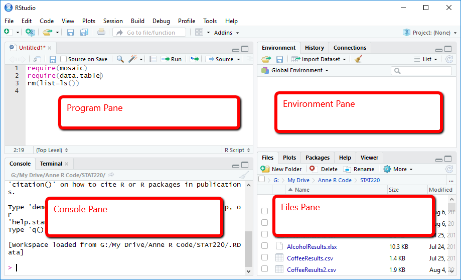



## What is R? 🤔

R is much more than just a statistical software! It's a complete
programming language and environment designed for:

-   Data analysis and statistics
-   Data visualization
-   Machine learning
-   Report generation
-   Web applications
-   Geographic Information Systems (GIS)
-   And much more!

::: callout-note
## Real-World Applications in Fisheries

-   Analyzing catch data
-   Creating automated reports
-   Making interactive dashboards
-   Mapping fishing grounds
-   Population modeling
-   Image analysis (e.g., fish identification)
-   Environmental data processing
:::

## Pros of R? 🎯

1.  **Free and Open Source**
    -   No license costs
    -   Community-driven development
    -   Transparent methods and algorithms
2.  **Huge Community**
    -   Over 19,000 packages available
    -   Active support forums
    -   Regular updates and improvements
3.  **Reproducible Research**
    -   Code documents every step
    -   Easy to share and verify methods
    -   Perfect for scientific publications
4.  **Versatile**
    -   Works on all major operating systems
    -   Handles various data formats
    -   Integrates with other tools

## Installing R and RStudio 💻

### Step 1: Install R

First, you need to install R itself:

1.  Go to [CRAN (The Comprehensive R Archive
    Network)](https://cran.r-project.org/)
2.  Click on the link for your operating system:
    -   Windows: "Download R for Windows" → "base" → Download the .exe
        file
    -   Mac: "Download R for macOS" → Select the appropriate version
    -   Linux: Choose your distribution and follow the instructions

::: callout-tip
## Installation Tips

-   Windows users: Install R in the default directory (usually
    C:\Program Files\R)
-   Mac users: You might need administrator privileges
-   Linux users: Consider using your package manager (apt, yum, etc.)
:::

### Step 2: Install RStudio

RStudio is an Integrated Development Environment (IDE) that makes
working with R much easier:

1.  Visit [RStudio
    Downloads](https://posit.co/download/rstudio-desktop/)
2.  Scroll down to "RStudio Desktop"
3.  Download the free version for your operating system
4.  Install following the default options

::: callout-important
Always install R first, then RStudio. RStudio needs R to work!
:::

## Understanding RStudio's Interface 🖥️

RStudio has four main panels (clockwise from top-left):



1.  **Program Pane**
    -   Where you write and edit your code
    -   Create and modify R scripts
    -   Write R Markdown documents
2.  **Environment/History**
    -   Lists your current objects and data
    -   Shows command history
    -   Manages connections
3.  **Files/Plots/Packages/Help**
    -   Browse files and folders
    -   View plots
    -   Install and load packages
    -   Access documentation
4.  **Console**
    -   Run R commands directly
    -   See output and messages
    -   Test quick calculations

## Creating Your First R Project 📁

Projects help organize your work and make it portable. Here's how to
create one:

1.  In RStudio, click `File → New Project`
2.  Choose `New Directory`
3.  Select `New Project`
4.  Fill in:
    -   Directory name (e.g., "my_fisheries_analysis")
    -   Where to create the project
    -   Click "Create Project"

### Understanding Project Structure

A well-organized project should have these folders:

```         
my_fisheries_analysis/
├── data/          # Raw data files
│   ├── raw/      # Original, unchanged data
│   └── processed/ # Cleaned and processed data
├── R/            # R scripts
├── outputs/      # Results, figures, tables
│   ├── figures/  # Plots and visualizations
│   └── tables/   # Generated tables
└── docs/         # Documentation and reports
```

::: callout-tip
## Best Practices for Project Organization

-   Keep raw data separate and unchanged
-   Use relative paths (project root as reference)
-   Name files and folders consistently
-   Include a README file explaining the project
:::

## Your First Task: Setting Up Your Environment 📋

1.  **Install Required Software**
    -   Download and install R
    -   Download and install RStudio
    -   Test that both are working
2.  **Create Your First Project**
    -   Open RStudio
    -   Create a new project called "ssf_analysis"
    -   Set up the folder structure as shown above
3.  **Verify Your Setup**
    -   Open RStudio and create a new R script
    -   Save it in your R folder
    -   Try this simple code:

```{webr}
#| autorun: false
# Print a welcome message
print("Welcome to R!")

# Get your R version
R.version.string

# List your project directories
list.dirs(recursive = FALSE)
```

## Troubleshooting Common Issues 🔧

### Problem: R/RStudio Won't Install

-   Check system requirements
-   Run installer as administrator
-   Clear temporary files and try again

### Problem: Can't Create Project

-   Check write permissions in target directory
-   Close other RStudio instances
-   Restart RStudio

### Problem: RStudio Doesn't Find R

-   Reinstall R first, then RStudio
-   Check if R is in system PATH (Windows)
-   Verify R installation directory

## Next Steps 🚀

After completing this setup: 1. Explore RStudio's interface 2. Try
creating and saving some R scripts 3. Practice navigating your project
structure 4. Get ready for data import and analysis!

::: callout-note
## Additional Resources

-   [RStudio IDE Cheat
    Sheet](https://raw.githubusercontent.com/rstudio/cheatsheets/main/rstudio-ide.pdf)
-   [Project Management with
    RStudio](https://support.posit.co/hc/en-us/articles/200526207-Using-RStudio-Projects)
-   [R Installation FAQs](https://cran.r-project.org/doc/FAQ/R-FAQ.html)
:::

Remember: Taking time to set up your environment properly will save you
hours of frustration later!


Next: [Basic Operations](2_rbasics.html)
